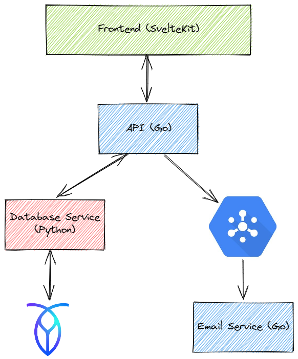

# Welcome to Isaac's Portfolio Site Repository!

This GitHub repository contains the majority of the code and infrastructure
configuration for my personal portfolio website, which is available to view at
[ihh.dev](https://ihh.dev).

## Technical Overview

**TL;DR**: This website combines a SvelteKit frontend with three backend services
written in Go and Python. The whole app is deployed to Google Cloud App Engine
and uses Pub/Sub for asynchronous tasks (sending email). Email form responses
and all work experience and personal project data is stored in a CockroachDB
cluster on the free tier of the CockroachCloud service.

The following is a more detailed overview of the technical architecture of this
website, including the reasoning behind the design decisions.

### Why so complex?

This website could have easily been a simple static site written in pure HTML
and CSS, with the work experience and personal project data stored in a JSON
file. However, I wanted to explore using Google App Engine with a microservice
architecture, and I also wanted the opportunity to experiment with technologies
I don't get the chance to use at work. It also gave me an excuse to try working
with a frontend framework. Before this project, I hadn't created any web apps
from scratch, usually using WordPress for client projects in the past.

Another big reason for making it so complex is because it's a portfolio site,
and I wanted it to be a true representation of what I can do. That's the
primary reason I decided to open-source the code, so that anyone can see how
the site works and what I've built, and hopefully take some inspiration from
it for their own projects!

### Overview

The website is a single-page application (SPA) written in SvelteKit. The
backend comprises three microservices: a Go webserver that acts as an API layer
for the frontend, a Python webserver that handles database interaction and a Go
webhook that receives asynchronous email requests from Pub/Sub.

The database of choice is a serverless CockroachDB cluster on the free tier of
CockroachCloud. The database is used to store all work experience and personal
project data, as well as email form responses.

### Frontend

The frontend application is written in SvelteKit, which runs on the Svelte
compiler. I've heard great things about the Svelte developer experience, and I
was excited to try it out. I'm not fond of React, and while I use Flutter for
app-related projects, I wanted to try something different for this website.

Other than a few JS/React tutorials, I had no prior experience of JavaScript or
frontend development coming into this project, so please excuse the likely
less-than-perfect quality of the JavaScript and TypeScript code in the frontend
app. I'm sure there are plenty of improvements that could be made, but I'm
happy with the result for now.

I really like the fact that SvelteKit runs a backend Node server for
server-side rendering. It makes it easy to create a fast, dynamic site, and
provides nice features that other frameworks (read: Angular) don't provide,
like the ability to make proper use of environment variables. It also helped
keep concerns separate, minimising the number of API calls that need to be made
from the client to third party APIs (e.g. reCAPTCHA, which is used in the
email form to prevent spam).

### API Service

The API service is a Go webserver written using `net/http` from the Go standard
library. It handles all communication between the frontend and the other
services. Primarily, it interacts with the Python database service over HTTP,
but it also publishes email form responses to Google Pub/Sub.

I had to create a few custom types to properly marshal and unmarshal the
timestamp objects from the Python API, as seen in the [`iso.go`](api/iso.go)
file, but otherwise it's a straightforward webserver.

### Database Service

The database service is a Python webserver written using FastAPI. It uses
SQLAlchemy as the ORM, as this has good FastAPI integration, and uses the
PostgreSQL dialect for CockroachDB. The database service handles all
communication with the database, and is the only service that has direct
access to the database cluster.

The API integrates with Pydantic for data validation. In a production
environment, I would also use Alembic for schema versioning, but I didn't think
that was necessary for this project.

This services uses a certificate file that is not committed to the Git
repository as part of the authentication process with the database.

### Email Service

Again, the email service is a Go webserver. It accepts POST requests from the
Pub/Sub queue, and sends email via the Mailjet API. Each email form response
generates two emails - a thank-you email to the sender, and a copy to me. This
is the simplest of the services.

### Deployment

The whole app is deployed to Google App Engine, with `app.yaml` files
containing environment variables and config. The exact files are not committed
to the Git repository, but each service has a `app.example.yaml` file that
shows an example of the config used.

Each service also has a Dockerfile for use with `docker-compose`. There is a
`docker-compose.yaml` file in the root of the repository that can be used to
run the app locally. This is how I completed the majority of my development.

It contains a service for each of the frontend and backend services, as well as
a single-node CockroachDB cluster.

## Contributing

If you find any bugs or have any suggestions for improvements, please feel free
to open an issue or pull request. I'm always happy to receive feedback!

I haven't had time to write a full suite of tests for the Go services, and
there's some work to do on security, but please let me know if you spot
anything that urgently needs doing!

## License

This project is licensed under the MIT License. See the [LICENSE](LICENSE.md)
file for more information.