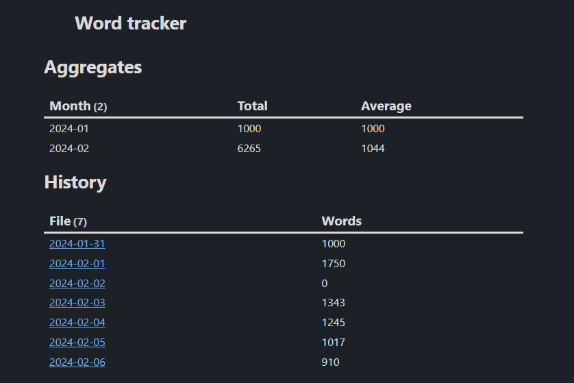

I was recently listening to an episode of Ali Abdaal's Deep Dive podcast with Nathan Barry, the founder of the newsletter platform ConvertKit. Now, Nathan is a prolific writer. That's probably not a surprise - he did create a SaaS business around helping people reach other people with their writing.

One of the things Nathan and Ali talked about was an experiment Nathan conducted in 2012. Starting in May, Nathan decided to commit to writing 1000 words a day. Now, if you're a journalist or someone who writes professionally in any capacity, you're probably thinking "So what? I could write 1000 words in my sleep".

And you're probably right.

But, at the time, Nathan wasn't a professional writer. He was a software designer. He's since written a number of books, thousands of words of guest posts, articles and newsletter editions. According to [Nathan's blog](https://nathanbarry.com/commitment-changed-career), this has completely changed his life.

I was inspired by this, so I decided to do the same.

## My experience so far

I started this venture on the 31st of January, 2024. That's only a week ago at the time of writing. And guess what. It's _fun_. I'd often come home from work pretty drained, and all I'd want to do is collapse. Working as a Founding Engineer can be quite mentally tough (something I _definitely_ want to get into in a future article, so get subscribed!), and doing more than the bare minimum of an evening felt like quite a lot.

But I need to write. I'm a content creator, after all! I have scripts to write, Tweets (I will never, ever call them Xs, or "posts on X". Get a grip, Elon), LinkedIn posts, articles. You name it, I probably have to make it if I ever want this content creation thing to get off the ground.

So, on January 31st, I committed to writing 1000 words per day. Not every day - some days aren't conducive to writing - but on average. I'm not counting any writing of emails, proposals and so on I do at work - I'm only going to count things I write outside of working hours.

## So what counts?

Well, everything, really. I fully script most of my YouTube videos, so they'll definitely count, as will articles like this one. I'll probably also track social posts like Twitter and LinkedIn, since I'm still technically writing words for those.

There are a couple of things that definitely don't count:

1. Messages (WhatsApp, Discord, Slack)
2. Code
3. Slides

The last one is a little confusing, so let me explain.

I create the slides for my videos using [Obsidian Advanced Slides](https://github.com/MSzturc/obsidian-advanced-slides). Since most of my videos use GIFs or external images, this leads to a lot of "words" in the slide documents thanks to the links. Did you know that most word counters will count [https://ihh.dev](https://ihh.dev) as 3 words?

It kinda makes sense, but then you get Giphy links, like the following:

```text
https://media3.giphy.com/media/v1.Y2lkPTc5MGI3NjExN3E3amd3cG1lY21pdmZoMjZiYW1iNTl5ZDByMDNrZzQ0bWhvcmVnbiZlcD12MV9pbnRlcm5hbF9naWZfYnlfaWQmY3Q9Zw/Vuw9m5wXviFIQ/giphy.gif
```

Guess how many words?

If you guessed 10 words, well done.

And I don't think it's fair to call that 10 words, so I'm discounting all slide content. I'm just hoping this doesn't discourage me from writing slides for videos that need them 😅

## How am I tracking everything?

Semi-manually, really. I'm not using anything fancy that automagically keeps track of how many words I'm writing each day. What I'm mostly going doing is looking at the word count in Obsidian before and after a writing session, taking the difference and adding it to what I've already logged for the day.

I'm logging everything in [Obsidian frontmatter](https://help.obsidian.md/Editing+and+formatting/Properties) - each of my daily notes has a `words` frontmatter property now - and tracking my running tally and monthly averages using the [Obsidian Dataview](https://github.com/blacksmithgu/obsidian-dataview) plugin.

For the curious, the tables look like this:



And the code for them looks like this:

```
table sum(rows.words) as "Total", round(average(rows.words), 0) as "Average"
from "Daily Notes"
where nonnull(words)
group by truncate(file.name, 7, "") as Month
```

```
table default(words, 0) as Words
from "Daily Notes"
where file.name >= "2024"
sort file.name asc
```

The first is the monthly overview, and the latter is the whole history since I started. As a side note, Dataview is awesome.

## What's next?

This post was created for a couple of reasons:

1. It helps me hit my word count for today (Obsidian reckons 787 words so far)
2. It's a public commitment to doing this!

If anyone reckons I'm slacking, or you just wanna check on my progress, pester me on [Twitter](https://twitter.com/IsaacHarrisHolt). I'm also going to challenge any budding writers in my audience to follow along with me and take on this task. Let me know how you get on!

What if I'm not motivated to write? Well, too bad, I'm still gonna write. In his book [The Chimp Paradox](https://amzn.to/3OyruMc), Prof. Steve Peters writes:

> When you decide to do something, remind yourself that it is commitment not motivation that matters.

Not having motivation sucks, but you can still get by without it. Sometimes this writing will feel like a slog, and there have been some days where it has! But it's a commitment now, and I see my commitments through.

Love y'all,

Isaac
