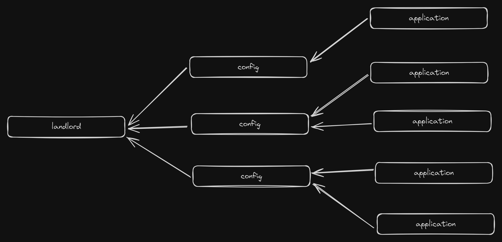

There's been a lot of debate going on in dev circles around separation of concerns. Specifically, some larger creators in the dev sphere have spoken out against keeping logic in the database, instead preferring to keep the database purely for storing data.

And I get it. I really do. Keeping logic in the database can pose problems. Databases aren't typically designed for that, and you can tell from the developer experience.

If I want to search for the implementation of a particular function in my REST API, I just find the file that contains that code and read through it.

With Postgres though? That's a bit more difficult. I typically have three options:

1. Try to find the most recent migration that updates that function;
2. Query the internal Postgres tables to get the function definition; or
3. Use a tool that can surface the function definition for me

None of those are particularly decent solutions. Of course, depending on how you manage migrations, option 1 can be relatively easy (a grep and sort by timestamp) or incredibly difficult and time consuming.

I tried searching to see if there are any ORMs or migration tools that have good support for stored procedures, triggers, etc. and sadly I couldn't find anything. If you know of any, please share them with me on [TwitX](https://twitter.com/IsaacHarrisHolt)!

In the meantime, let me make my case for keeping logic in the database.

## When the database is the perfect place for logic

### Full-stack apps

Most large scale applications will have a single point of communication with the database. It's generally some sort of public-facing API service, or it's something like a microservice that's triggered by another internal service.

In these cases, where the data-manipulation is very clearly encapsulated in one place, you probably don't need logic in the database.

I'm not saying you wouldn't benefit from it - by keeping things in the database, you remove the need for costly network calls - but you probably won't see much in the way of improvement from an architectural standpoint.

However, fewer and fewer apps are being built that way these days. The cool new kid on the block is the full-stack framework. Think Next.js or SvelteKit (😍). With these frameworks, your frontend and server-side logic are much more closely linked, and typically run from the same codebase.

This is great for developer ergonomics. I can set up a new page, quickly use an ORM to grab the exact data I need on the server side, and then seamlessly pass this to the frontend I'm building at the exact same time.

It makes development really _fast_.

The problem comes when you start to introduce things that need to react to other things.

And when those things are everywhere, it makes development really _painful_.

Let me give you an example. At [Pluto](https://stairpay.com), our goal is to help anyone afford the home of their dreams. We've been focusing on [Shared Ownership](https://www.stairpay.com/academy/a-quick-intro-to-shared-ownership-for-first-time-buyers) in the UK, and one of the processes within that is a process called "staircasing" whereby a resident can purchase more shares in their property.

One of the things we built early-on was an online application flow to allow residents to gather their documents and information in one place, packaging all necessary details up for them to send off to their landlords.

We store these applications in a table aptly named `staircase_application`.

When we originally designed the application flow, we looked at the data that most of the largest Shared Ownership landlords in the UK require for their staircasing processes, and built something that would gather that data.

Naturally, though, things are never that simple. We've since had to expand the flow and add another table, `staircase_application_config` that determines which fields of the application are required, optional or completely disabled for a particular landlord.

This table is append-only so we can track the history, and each `staircase_application` record has a foreign key to a config record. This way, if config changes for a landlord, existing applications remain unaffected.

This means two things:

- Every new landlord needs to have the default config inserted when added
- Every new `staircase_application` needs to automatically pick up on the latest config record for the relevant landlord

There are a few flows that allow `staircase_application` records to be created. and because we work in multiple full-stack monoliths (we have a few web apps), not all of this is nicely encapsulated in one place.

Sure, it probably could (and should) be, but we're a startup. We move too fast for that 😎

In all seriousness though, even if we were to refactor all our code so that staircase application creation was all packaged up, we'd still have to fetch the latest config record before doing the insert.

We could avoid a network call with a [Postgres trigger](https://www.postgresql.org/docs/current/sql-createtrigger.html), so that's exactly what we do. Every time a new application is inserted, we first grab the latest config record for that landlord and set the foreign key field.

And how do we know there'll definitely be a config record available? We have a trigger on the landlord table, of course.

### Security

We have quite a lot of validation logic in the database. We also use [Supabase](https://database.new) for our database, so we use a lot of [row-level security](https://supabase.com/docs/guides/auth/row-level-security) policies and functions for managing them.

That's another place where you should probably be keeping your logic in your database. Whether it's RLS or just permissioned users, by having some form of security built into your database, you're removing another potential attack vector.

Why do you think the big players in the document database space do it? Both MongoDB and Firebase have extensive permissions engines, and nobody bats an eyelid. So why all the fuss when it's relational?

---

I hope this article has given you something to think about. I'm going to keep writing logic for my database, and maybe, someday, I'll even make a nice solution for the visibility problem.

Happy coding,

Isaac
