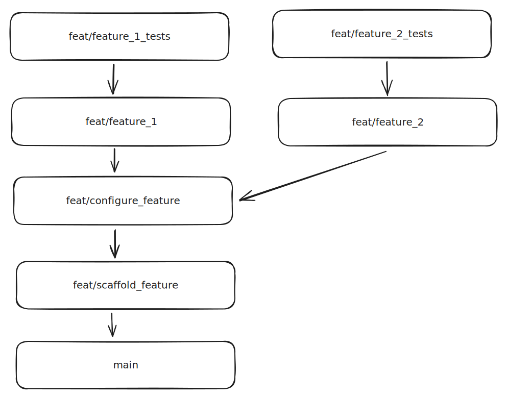
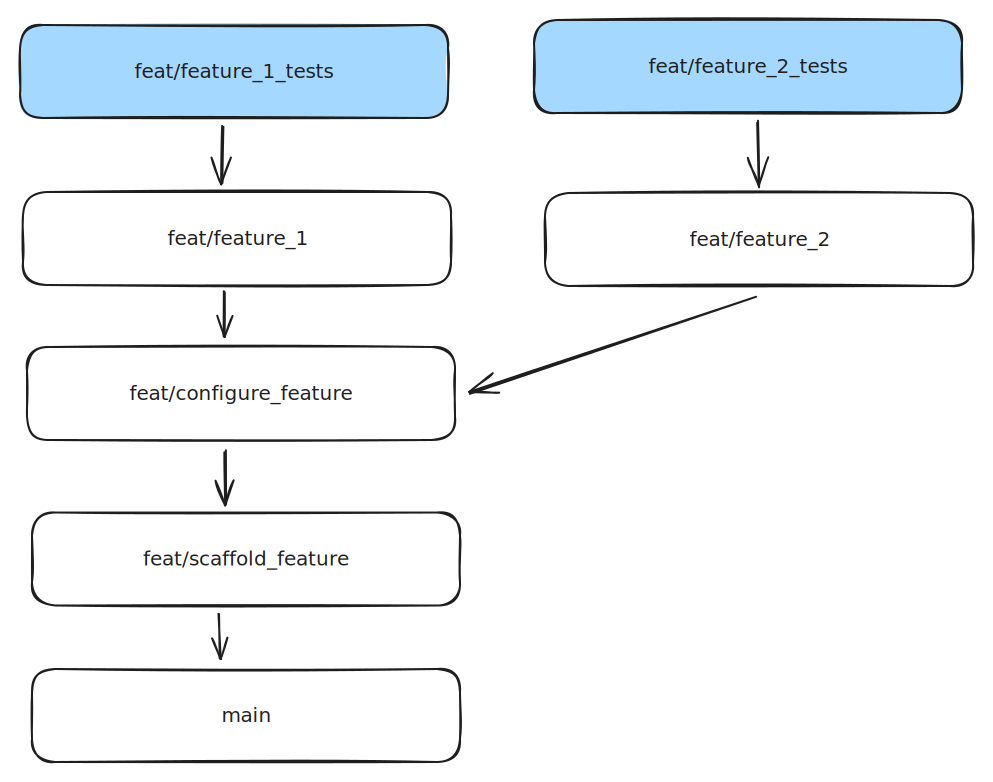

We've all been there. We arrive at our desk on Monday morning to find that our over-eager colleague has been working all weekend and completed their feature work early.

Great! Mostly...

Unfortunately, the feature they were working on was quite large, and your colleague got a bit wrapped up in the code. It's all in one PR.

You've got a fun morning ahead.

---

Enter Graphite.

Graphite is a CLI tool and web app that makes it easier to adopt a "stacked" Git workflow. Essentially, instead of a project ending with a giant PR with lots of individual commits, you create a project from multiple PRs, where each is based on the last.

It's what you'd see if you split each commit into its own branch, and pointed that branch at the one that came before it.

Sounds pretty useless, right? Well, no. By splitting PRs this way, things become _much_ easier to review. This is actually how the tech giants like Google and Meta work (though they don't always use Git).

Anyway, I'm not here to evangelise the stacked Git workflow. There's an excellent website called [stacking.dev](https://stacking.dev/) that explains the benefits a lot better than I ever could.

No, I'd like to talk about something different.

## The CI problem

There are a couple of issues you might run into if you move to a stacking workflow using Graphite, like we have at [Pluto](https://stairpay.com). The first is the adjustment period - it feels weird to be constantly creating branches and PRs - but once you pop you just can't stop.

The big issue, unfortunately, is money. In most projects, a push to a Git branch will trigger some sort of automated testing. For us, this is via GitHub Actions. These CI runs aren't free, and you're billed based on how long the VMs used to host them are running.

This is normally fine, unless you have one of those developers who pushes every time they commit. Even then, there are ways to mitigate CI sprawl and save on cost. One particularly useful tool for this is [concurrency groups in GitHub actions](https://docs.github.com/en/actions/using-jobs/using-concurrency#example-concurrency-groups). These allow you to ensure you only have a single process running for a specific group name (usually based on the branch name), and a newer push can stop the processes started by an older one.

Unfortunately, since Graphite creates a new branch for each change, you can't rely on branch names. You could potentially do something funky with a branch name prefix, but it only takes a single typo and that all goes belly-up.

Secondly, with Graphite, if you push a whole stack of changes, you still create a branch _for each change_, so you end up with 10 CI progresses running in parallel, rather than the 1 you would get if you were pushing to a single branch.

This sounds awful! I'm going to be losing so much money!

## The solution(s)

You know me, I'm not going to drag your spirits down like this without a solution or two.

The first is to use a workflow caching tool like [Turborepo](https://turbo.build/repo) (JS/TS) or [Pants](https://pantsbuild.org) (Python). These can essentially cache your workflow jobs like tests or linting, skipping them if the inputs haven't changed. They typically store the cache results remotely so results can persist across multiple isolated CI runs. This is the solution the Graphite team uses in their own CI/CD pipelines.

There are still a couple of issues here though: a) you still have to waste CI time installing these tools on your VM, and b) these don't really work if all your CI processes are running at the same time.

The other solution I'm able to come up with (and the one we chose to use) is to run a simple check at the start of each run to see if we actually need to be running CI for this branch.

Basically, Graphite PRs each point at the PR that came before.



We can use this fact to only run our jobs if we're at the _top_ of the stack, thereby ignoring any PRs that have had further changes made to them.



The example I'm going to show is for GitHub actions, but I'd imagine there are ways to do this in other CI/CD systems.

TL;DR: we're going to use the GitHub API to search our repo for PRs pointing at the current branch, and skip CI if we find any.

Thankfully, GitHub Actions runners come with the GitHub CLI (`gh`) pre-installed, so we don't need to do anything particularly special.

We start by getting the list of open PRs against the current branch:

```bash
current_branch=$(git rev-parse --abbrev-ref HEAD)

prs=$(gh pr list --state open --base $current_branch --json number --jq '.[].number')
```

The `--jq` flag in the GitHub CLI is super useful - it allows us to use the functionality of the `jq` command line tool without having to install it first. We use it to just grab the PR numbers - we only actually need the count, so the rest of the information is irrelevant.

We can then get the number of open PRs using `wc`:

```bash
current_branch=$(git rev-parse --abbrev-ref HEAD)

prs=$(gh pr list --state open --base $current_branch --json number --jq '.[].number' | wc -l)
```

Finally, if the number of PRs is greater than 0, we can `exit` with a non-zero return code to stop the CI process!

```bash
current_branch=$(git rev-parse --abbrev-ref HEAD)

prs=$(gh pr list --base $current_branch --json number --jq '.[].number' | wc -l)

if [[ "$prs" -gt 0 ]]; then
	exit 1
fi
```

The last step is to bundle this up into a shell script and run it as the first part of the CI process!

## Tweaks and improvements

This works great! But that doesn't mean we can't make it better. We might, for example, have a long-lived branch (like `main`) that we always want to run CI on. In that case, we simply exit early:

```bash
current_branch=$(git rev-parse --abbrev-ref HEAD)

if [[ "$current_branch" == "main" ]]; then
    exit 0
fi
```

You can then use concurrency groups to limit CI runs on those branches.

Graphite stacks also don't submit immediately - there can be a bit of a delay between each PR being created. To account for this, we can add a short sleep to the top of the script:

```bash
sleep 3
```

Then it'll work perfectly!

Buuuuuuuuuut...

If a branch is skipped, it looks like the CI fails on GitHub. This could be a problem if you have some sort of branch protection rules.

The way we get around this at Pluto is to have the script echo `BYPASS` or `RUN` instead of exiting...

```bash
sleep 3

current_branch=$(git rev-parse --abbrev-ref HEAD)

if [[ "$current_branch" == "main" ]]; then
    echo "RUN"
else
    prs=$(gh pr list --base $current_branch --json number --jq '.[].number' | wc -l)
    if [[ "$prs" -gt 0 ]]; then
        echo "BYPASS"
    else
        echo "RUN"
    fi
fi
```

...and then in our Action, we pipe this into the `$GITHUB_OUTPUT` variable so that the result can be accessed by later jobs.

We make heavy use of [reusable workflows](https://docs.github.com/en/actions/using-workflows/reusing-workflows), so we simply ignore the call step if the result is not `RUN`:

```yaml
name: Bypass current branch

on: push

concurrency:
  group: branch-check-${{ github.workflow }}-${{ github.event.pull_request.number || github.ref }}
  cancel-in-progress: true

jobs:
  bypass-current-branch:
    runs-on: ubuntu-latest
    outputs:
      result: ${{ steps.run-bypass.outputs.result }}
    env:
      GH_TOKEN: ${{ github.token }}
    steps:
      - name: Checkout code
        uses: actions/checkout@v3
      - name: Run bypass
        run: |
          echo "Bypassing current branch"
          echo "result=$(./.github/scripts/bypass-current-branch.sh)" >> $GITHUB_OUTPUT
        id: run-bypass

  run-application-tests:
    needs: [bypass-current-branch]
    if: needs.bypass-current-branch.outputs.result == 'RUN'
    uses: './.github/workflows/application_tests.yml'
    secrets: inherit
```

And that's it! The last two code blocks above are what we _actually_ run, not just some experimental examples. It really works, and it's saved us quite a lot of CI minutes.

## External Git-based build processes

That's all wonderful, but you might run into one last problem. If you use an external hosting platform that's based on Git pushes, like [Vercel](https://vercel.com) or [Fly](https://fly.io), you'll still see a new deployment being created for every Graphite PR.

The costs mount up quickly here, too, especially the time cost of Vercel deployments if you use their build queue.

The way we get around this is by disabling the automatic Git builds and using GitHub actions to trigger the deployments manually. It works a treat!

Just make sure you add a manual trigger to your deployment workflow, so you can quickly push a new build if you don't have time (can't be bothered) to wait for all your tests for a quick patch.

We get it. Pobody's nerfect.

---

If you've found this useful, I'd love to know! Feedback is always welcome :)

And if you're interested, our CI pipelines look like this:


Fun, right?
