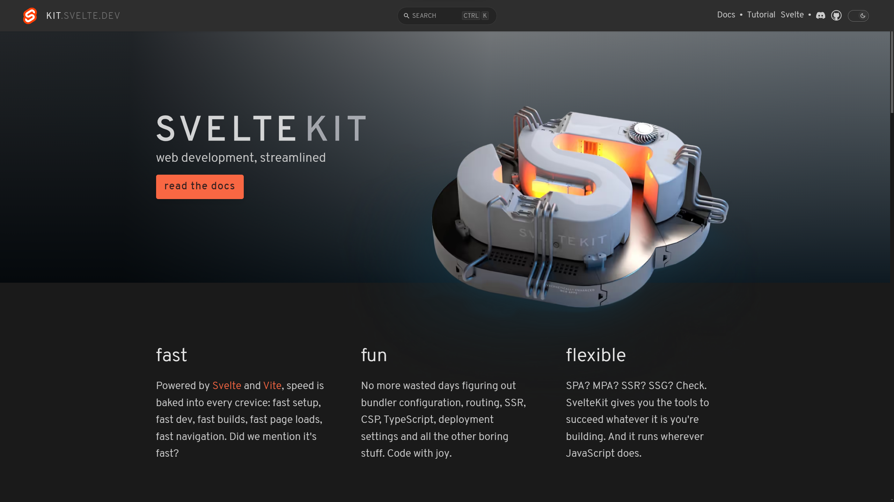
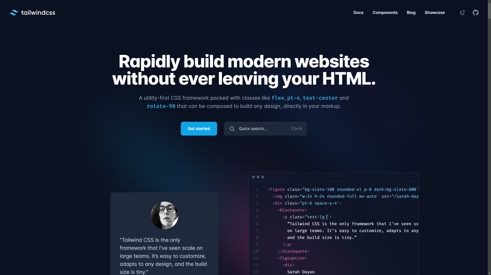
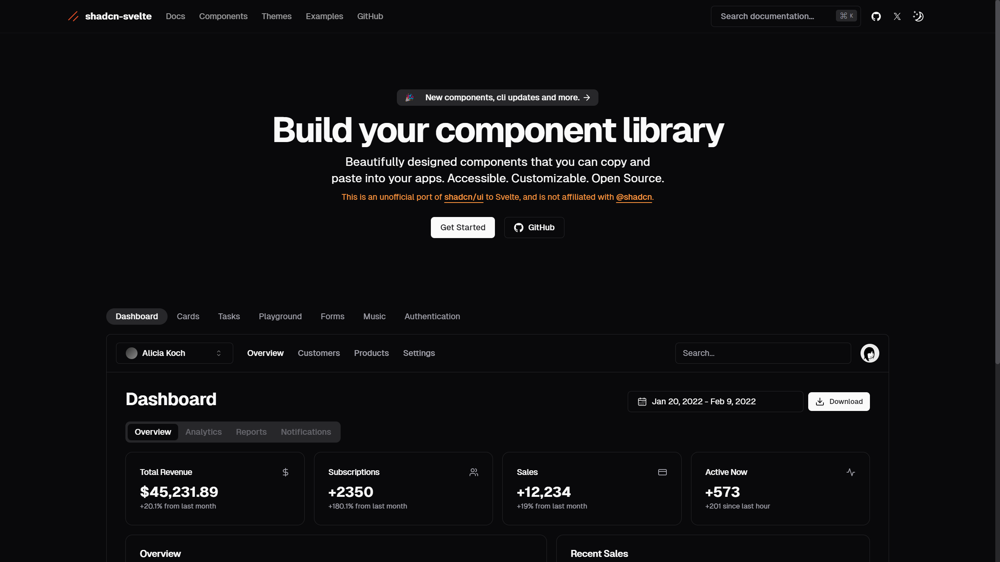
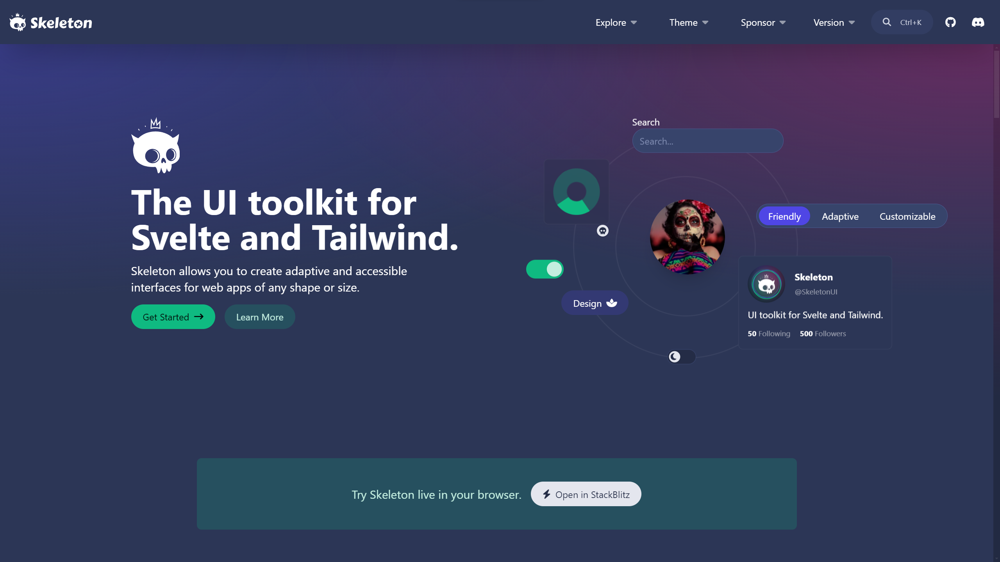
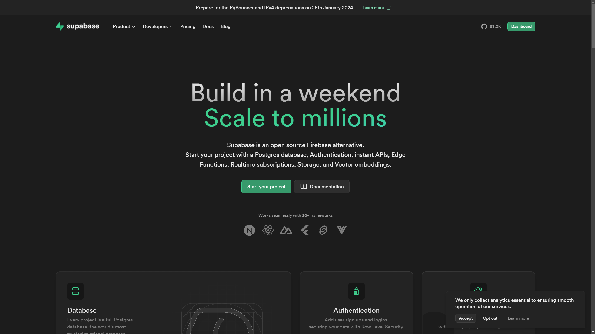
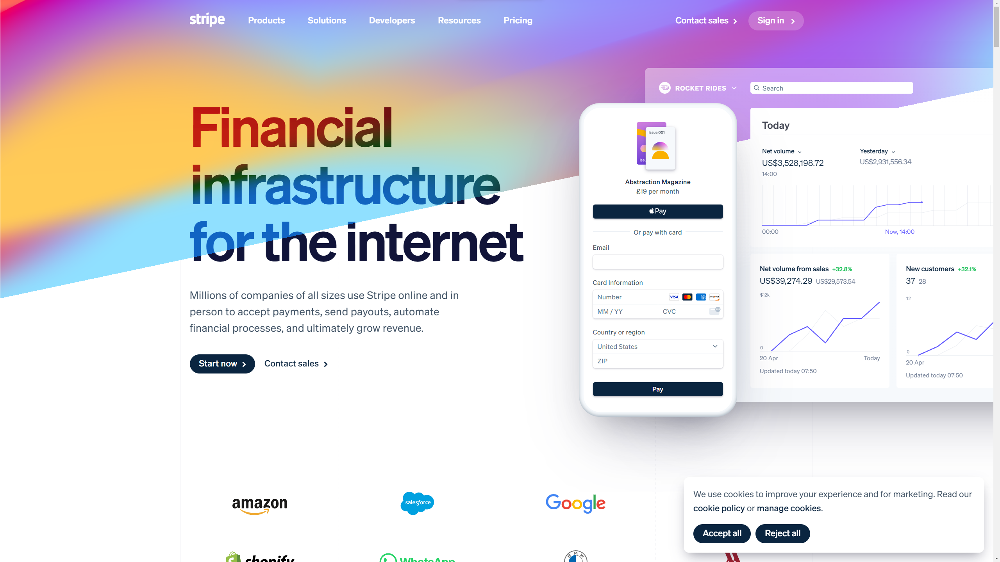

Sometimes it feels that in order to be a successful dev content creator/influencer these days, you need to come up with a tech stack with a catchy acronym. And as someone who does, in fact, want to become a successful dev content creator/influencer, I feel like I'm falling a bit behind.

We're all familiar with the LAMP stack: **L**inux, **A**pache, **M**ySQL and **P**HP. But that's a little outdated these days. Feels like a bit of a relic of the past, you know? It's not the only one. MERN (**M**ongo, **E**xpress.js, **R**eact, **N**ode.js) has also fallen very much out of the public eye. They're still in use, but they're not _trendy_ anymore, so I've got to make sure I don't include _any_ of the technologies included in either of those.

Also, Mongo. Ew.

And then you have some popular YouTuber stacks. In particular, [Fireship](https://youtube.com/Fireship) has his FKIT stack (which is comprised **F**irebase, Svelte**Kit**, TailwindCSS and Stripe). Other stacks that are popular (read: that I have come across during my limited internet trawl) include:

- [The HATE stack](https://www.youtube.com/watch?v=bti-bnGbyak&pp=ygUSYXdlc29tZSBoYXRlIHN0YWNr): **H**TMX, **A**lpine, **T**urso and **E**cho (Go);
- [The BETH stack](https://www.youtube.com/watch?v=cpzowDDJj24&pp=ygUOYnVuIHRlY2ggc3RhY2s%3D): **B**un, **E**lysia, **T**urso, **H**TMX;
- [The Double D stack](https://www.youtube.com/watch?v=-A0kMiJqQRY): **D**rizzle ORM, Clerk Auth, Next.js, **D**Beaver (the name is a _little_ tenuous, but we'll let it slide); and of course:
- [T3](https://t3.gg): **T**ypeScript, **T**ailwindCSS, **t**RPC

So, doing a bit of analysis on the above, it looks like a good tech stack needs:

1. A UI library
2. A backend server technology
3. A database and/or ORM
4. Probably some styling
5. And optionally a payment system

So, how do I come up with something with a fun name? Let's take a look at the tech I use on the daily.

## SvelteKit



[SvelteKit](https://kit.svelte.dev) is by far and away my favourite frontend/full-stack framework. I got started using it when I joined [Pluto](https://stairpay.com). We were migrating away from Next as I joined, in fact. If you're interested in why, add [this article](https://blog.withpluto.com/the-pluto-stack-b28c5e008b74) to your reading list!

Anyway, I love Svelte's reactivity model, and I just find it feeling so much more productive than frameworks like React or Solid where you've got hooks littered all over the place. The other cool thing about Svelte is that it's actually primarily a compiler, not a runtime library. All your Svelte code just gets turned into plain old HTML, CSS and JavaScript. Pretty neat, and it leads to some pretty great frontend performance without too much faffing about and the need for memoization.

SvelteKit is also a great metaframework for Svelte. It's simple and straightforward to work with, and there are very few things I would change about it. I can't get over how easy it is to make sites that work with zero client-side JavaScript if you really want to (the support for form actions is impeccable), and, despite what lots of people say, I actually really like file-based routing.

## TailwindCSS



I don't think [Tailwind](https://tailwindcss.com) really needs much of an introduction. It's become pretty ubiquitous in the frontend space recently, and it's easy to see why. Not having to worry about ginormous CSS files is something that every dev should try at least once in their lives, and co-locating markup and styling? Well that just kinda makes sense.

Sure, if you want to use the same styles in 100 different places and have them all update simultaneously, Tailwind doesn't offer a solution for that. But it also doesn't really need to. That's what componentised UI libraries are good at. We have some code in our codebase for a `Panel` component that we use _everywhere_, and it's pretty much what you'd expect:

```html
<div class={twMerge('shadow-pluto overflow-hidden rounded-2xl border-[1px] border-gray-100 bg-white text-left', classes)}>
  <slot />
</div>
```

`twMerge` here is of course from the excellent [tailwind-merge](https://www.npmjs.com/package/tailwind-merge) package on NPM, which makes overriding styles easy.

Now that's something that regular CSS is _terrible_ at.

While Tailwind is lovely, it's still very manual. And, as a lazy person, I don't like lots of manual work. And so, I reach for a component library. Thankfully, Tailwind makes it really easy for (other) people to make beautiful framework-agnostic UI libraries.

One of my absolute favourites is [daisyUI](https://daisyui.com/). Again, this is what we use at work, and it makes styling certain components a breeze. We've outgrown it to some extent, and we've created our own component library, but a lot of it is still based on daisyUI at its core.

But I use that all the time at work, so I don't wanna be using it in my spare time. The fact it's framework-agnostic also means it's inherently limited - there are some interactions that (sadly) just _need_ JavaScript. Is it the only good UI framework for Tailwind?


Two others, in fact.

### `shadcn-svelte`



[`shadcn-svelte`](https://www.shadcn-svelte.com/) is a collection of components based on the highly popular [`shadcn/ui`](https://github.com/shadcn/ui) for React. It's become trendy thanks to the fact it takes a slightly different approach to your traditional component libraries.

Essentially, instead of having to install and import a whole component library from NPM, with `shadcn-svelte`, you instead use a CLI tool to copy and paste any components you wish to use into your project.

This way, you have full control over the code that's being displayed on your site, and you can go in and edit it to your heart's content. It ships with _loads_ of components, from the mundane UI bits like separators and buttons to highly interactive components like date range pickers and tab managers.

And because you're just using a CLI tool, not only can you pick and choose what you want, keeping your bundle size small, but you can easily grab new components as they're released without having to worry about dependency hell.

### Skeleton



On the other end of the spectrum is [Skeleton](https://skeleton.dev). Skeleton is a fully-featured component library made specifically for Svelte and Tailwind. It provides a slew of useful components from the basic card to toasts, tables and input chips.

While it does use Tailwind, Skeleton has one of the most comprehensive theming systems of any component library I've ever used. You can customise _everything_, including all your basic colours, the roundedness of your components, right through to your fonts and border sizes. It's really nice to use, and I've written a few projects using it.

And once you're done, Skeleton will automatically extend Tailwind with 'variant' classes that you can add to your components that will automatically adjust the colour HSL based on whether you're in light or dark mode.

Setup is awesome too. The Skeleton CLI can generate a whole new SvelteKit project for you with everything you need for Skeleton already installed. Oh, and there's a [Figma UI kit](https://www.figma.com/community/file/1266774078142216791/skeleton) available for anyone who wants to do their prototyping in not-code.

---

Well, so far, we're all sorted for frontend and backend code thanks to SvelteKit, and our sites are gonna look just fabulous thanks to Tailwind and any components we choose to use.

But, as a former data engineer, I'm totally restless until my data is nice and secure. We're obviously gonna need a database, but what else? Well, auth is probably a good shout, and possibly some blob storage as well, depending on the type of app we're building.

There are quite a few options here, from Google's Firebase to AWS Amplify, buuuuuut ain't nobody got time for proprietary software, right? Vendor lock in is real.

Wake up sheeple!

That limits our options somewhat. [PocketBase](https://pocketbase.io/) is a real contender here. Deployment is easy (it's a single binary and nothing else!), and everything is fairly straightforward. As a bonus, it's written in Go, which is one of my favourite languages.

Sadly, the database used under the hood is SQLite, which, while super convenient, isn't massively scalable without external services like Turso, and is a little feature-limited. I want a _real_ database (😎).

So, naturally, we have to go with -

## Supabase



There are sooo many reasons to love Supabase. It's unbelievably easy to set up, the Supabase client is pleasant to use (and the TypeScript wizardry that goes on is _nuts_), and it has just about every feature you could need.

Auth? Yep. You've got everything from traditional email+password auth and magic links through to OAuth2 and SAML SSO. Implementing password reset flows, multi-factor auth and everything else is a breeze, and there are excellent docs for integrating with various frameworks.

The auth is also tightly coupled with the database (which is just Postgres, by the way), and all your database security is handled using [RLS policies](https://blog.withpluto.com/postgresql-rls-policies-a-friendly-introduction-d024fc90b25f). Yes, this does mean that your logic is in your database, but in my opinion, [that's a good thing](https://www.ihh.dev/logic-in-the-database).

You also get blob storage, a vector database, realtime events edge functions and even a secret store. It's allllll bundled into one, and it's all open source.

And like I said, it's all. Just. Postgres.

So you can do anything you can do with a normal Postgres database. Don't like the Supabase client? Use Prisma or Drizzle. Need geospatial data? There's a Postgres extension for that. Fancy mixing document storage with a relational database with a sprinkling of timeseries tables? Yep, all good.

Postgres is _powerful_, and Supabase really leans into it.

The only thing that Supabase doesn't offer yet, that I wish it did (and I mean, it _kinda_ does), is some sort of message queue for serverless applications. It has database webhooks (call an edge function when a record is inserted) which can do the job just fine, but you still have to build things around those to make it as flexible as it might need to be.

I've actually been building a serverless message queue recently, and I'm going to be sharing some of my experiences once it's a bit more fleshed out. It's also going to be open source eventually. Why not [subscribe to my articles on Polar](https://polar.sh/isaacharrisholt) so you don't miss the updates?

## Stripe



Now that we've built our fast, sexy, scalable SaaS product, we need some way to take people's money. Naturally, we have to use Stripe for this. It's the most popular platform for a reason. Their APIs are exceptional, and everything is just to easy to stand up and use.

Admittedly there have been other great alternatives popping up recently, like [Lemon Squeezy](https://www.lemonsqueezy.com/), but they're not _quite_ there in terms of features, and SaaS pricing can get really complex. They have support for usage-based billing out-the-box, and products like [Stripe Connect](https://stripe.com/gb/connect) make setting up marketplaces like Uber or eBay a cinch.

## Naming our stack

Okay, like I mentioned earlier, we need a catchy name for our stack, or realistically, what was this all for?

Let's look at what we've got:

- SvelteKit
- TailwindCSS (`shadcn`/Skeleton)
- Supabase
- Stripe

There's a lot of 's'es in there. A _lot_ of 's'es, actually:

- **S**velteKit
- TailwindC**SS** (`**s**hadcn`/**S**keleton)
- **S**upaba**s**e
- **S**tripe

In fact, everything but Tailwind _starts_ with an 's'. That gives me an idea...

And that idea is buying another domain, of course! I currently own a grand total of too many domains, and I've just added another to the mix.

I asked my audience on [TwitX](https://x.com/IsaacHarrisHolt/status/1758617890465398850?s=20) and [YouTube](https://isaac.tube/community) their thoughts, and the top voted answers were
**S**<sup><strong>4</strong></sup> and **The Sssstack**. Unfortunately, domains for S<sup>4</sup> are a little out of my price range for a hobby, sooooo...

The Sssstack it is!

There's nothing there yet, but keep an eye on [sssstack.dev](https://sssstack.dev) and you might see some interesting stuff coming your way. I'll also post updates on here, so [get subscribed](https://polar.sh/isaacharrisholt).

Oh, and if anyone who reads this fancies themselves a bit of an artiste (or is an actual artist) and fancies coming up with a logo and/or landing page, I definitely wouldn't be one to complain. Let me know what you come up with via [TwitX](https://twitter.com/IsaacHarrisHolt)!

In the meantime, I hope you get a bit of enjoyment using The Sssstack™ in your projects. It's one of my favourite tech stacks to build in, and there's a good reason for it. I implore you to try it out.

But until then, happy coding!

Wishing you lots of love,

Isaac
